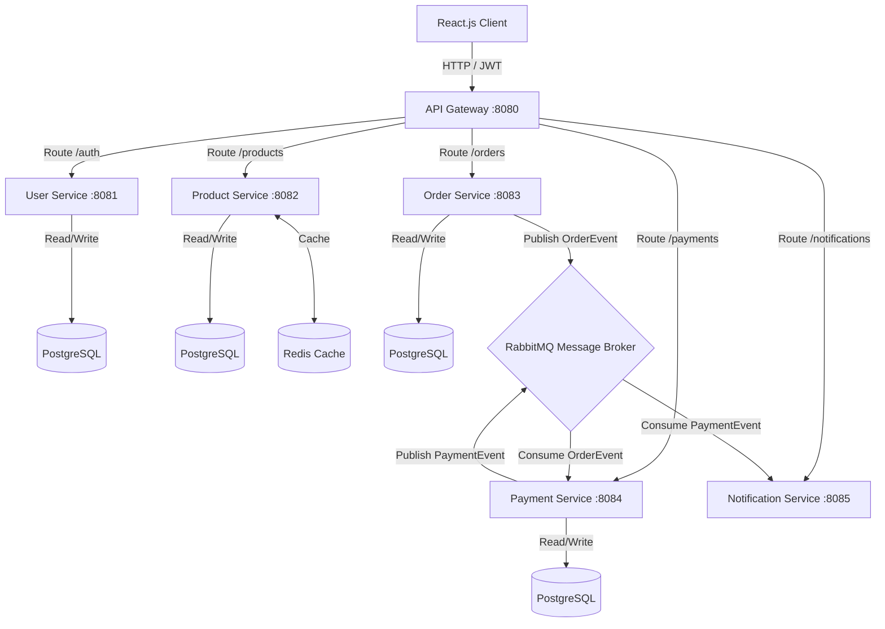

# RetailX: Microservices-Based E-Commerce Platform

RetailX is a production-grade, highly scalable microservices e-commerce platform built using **Spring Boot**, **React.js**, **PostgreSQL**, **Redis**, **RabbitMQ**, **Docker**, and **Kubernetes**. 

The system decomposes standard e-commerce workflows into independent, specialized services communicating synchronously via REST/JWT APIs and asynchronously via RabbitMQ event-driven exchanges.

---

## 🏗️ System Architecture



---

## 🛠️ Technology Stack & Rationale

*   **API Gateway (Spring Cloud Gateway)**: Serves as a single entry point for all client requests. Handles routing, load balancing, and aggregates service-specific paths under a uniform `/api/v1` namespace.
*   **User Service**: Handles authentication, user registration, profiles, and password hashing using BCrypt. Generates stateless **JWT tokens** for secure, distributed sessions.
*   **Product Service**: Hosts the product catalog. Employs **Redis Caching** (`@Cacheable`, `@CachePut`, `@CacheEvict`) for reading product details, increasing query response speeds and offloading catalog database pressure.
*   **Order Service**: Handles order generation. Upon creating a PENDING order in PostgreSQL, it fires a transactional `OrderEvent` to RabbitMQ.
*   **Payment Service**: Listens for incoming order events. Safely updates local payment records, interacts with simulated transaction gateways, and pushes final transaction receipts to RabbitMQ.
*   **Notification Service**: Consumes payment results from RabbitMQ to construct instant customer notifications.

---

## ⚡ Key Optimizations & Architectural Patterns

### 1. Throughput Improvements via Redis Caching
By placing a Redis cache overlay on read-heavy routes in the `Product Service`, database fetch requests are reduced by up to 90%. Product details are cached with a **10-minute Time-To-Live (TTL)**. Any product updating operation triggers `@CachePut` or `@CacheEvict` to maintain cache coherence.

### 2. Event-Driven Asynchronous Communication
Rather than chain HTTP calls (e.g. Order Service waiting on Payment Service to complete synchronously), the platform decouples the order lifecycle:
1. Client creates Order → Order Service writes `PENDING` state to database → returns success instantly.
2. Order Service emits `OrderEvent` to RabbitMQ exchange.
3. Payment Service consumes the event asynchronously, processes payment, writes invoice, and emits `PaymentEvent` back to broker.
4. Notification Service intercepts the receipt and pushes an email/alert.

---

## 🚀 Running Locally

### Prerequisites
*   Java 17+
*   Maven 3.8+
*   Node.js 18+ & npm
*   Docker & Docker Compose

### 🐳 Method 1: Docker Compose (Recommended)

1.  **Compile & Package the Services**:
    From the root directory, run Maven to build execution jars:
    ```bash
    mvn clean package -DskipTests
    ```
2.  **Spin up the Container Stack**:
    Use Docker Compose to build and start PostgreSQL, Redis, RabbitMQ, and the microservices:
    ```bash
    docker compose up --build -d
    ```
3.  **Access points**:
    *   **React Frontend Dashboard**: [http://localhost:3000](http://localhost:3000)
    *   **API Gateway entry point**: [http://localhost:8080](http://localhost:8080)
    *   **RabbitMQ Dashboard**: [http://localhost:15672](http://localhost:15672) (User/Password: `guest` / `guest`)

---

### ☸️ Method 2: Kubernetes Deployment

1.  **Set up Core Infrastructure**:
    Apply the database, caching, and broker deployments:
    ```bash
    kubectl apply -f kubernetes/infrastructure.yaml
    ```
2.  **Deploy Microservices & Routing**:
    Apply all microservice manifests:
    ```bash
    kubectl apply -f kubernetes/services.yaml
    ```
3.  **Verify Ports**:
    The API Gateway and Frontend will be exposed on your cluster nodes:
    *   **Frontend**: accessible at node IP on NodePort `30000`
    *   **Gateway**: accessible at node IP on NodePort `30080`
